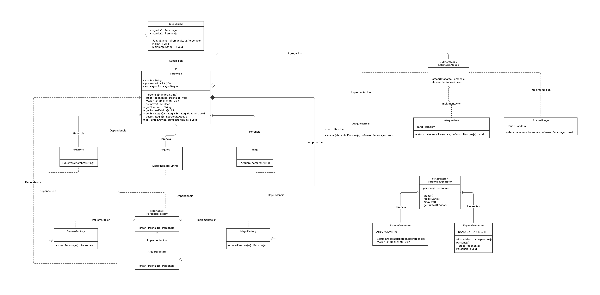

# Juego de Lucha — Refinamiento con Patrones de Diseño

[](https://github.com/dd0829429/juego-lucha-patrones/actions/workflows/ci.yml)


---

## Integrantes

- Daniel Andres Banguero Delgado
- William Yamith Andrade Getial
- Sebastian Ceballos Argaez

---

## Diagrama de Clases



---

## Patrones de Diseño implementados

### Factory Method
Crea personajes sin usar `new` directamente.

- `GuerreroFactory` → crea un Guerrero con AtaqueNormal
- `MagoFactory` → crea un Mago con AtaqueFuego
- `ArqueroFactory` → crea un Arquero con AtaqueHielo

### Strategy
Permite cambiar el comportamiento de ataque sin modificar `Personaje`.

- `AtaqueNormal` — daño 10-30 (igual al original)
- `AtaqueFuego` — daño 25-50
- `AtaqueHielo` — daño 15-35

### Decorator
Agrega armas y habilidades sin modificar la clase `Personaje`.

- `EspadaDecorator` — +15 daño al atacar
- `EscudoDecorator` — absorbe 10 pts de daño recibido

---

## Estructura del proyecto

```text
src/
└── main/java/com/juego/
    ├── model/
    │   ├── Personaje
    │   ├── Guerrero
    │   ├── Mago
    │   └── Arquero
    │
    ├── patrones/
    │   ├── strategy/
    │   │   ├── EstrategiaAtaque
    │   │   ├── AtaqueNormal
    │   │   ├── AtaqueFuego
    │   │   └── AtaqueHielo
    │   │
    │   ├── decorator/
    │   │   ├── PersonajeDecorator
    │   │   ├── EspadaDecorator
    │   │   └── EscudoDecorator
    │   │
    │   └── factory/
    │       ├── PersonajeFactory
    │       ├── GuerreroFactory
    │       ├── MagoFactory
    │       └── ArqueroFactory
    │
    └── juego/
        └── JuegoLucha

test/
├── PersonajeTest
├── StrategyTest
├── DecoratorTest
├── FactoryTest
└── JuegoLuchaTest